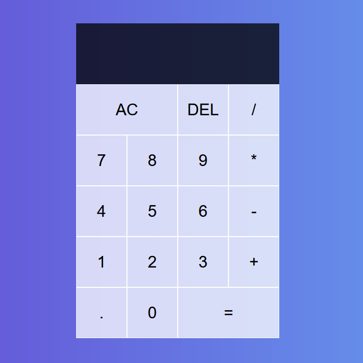

The practice calculator project was a test for my understanding of javascript, html, and css. I wanted to test out gitpages as well and learn how to use git in general. I decided to settle on spinning up a calculator that can do all the basic functions, as well as smooth out anything that can be used for convenience. For example, hitting the add button numorous time will continue adding that number as a sum and so on. I also wanted something colorful which I recieved help from youtube for the overall design of it.

